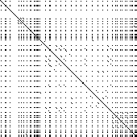
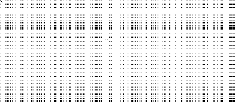
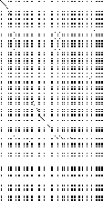
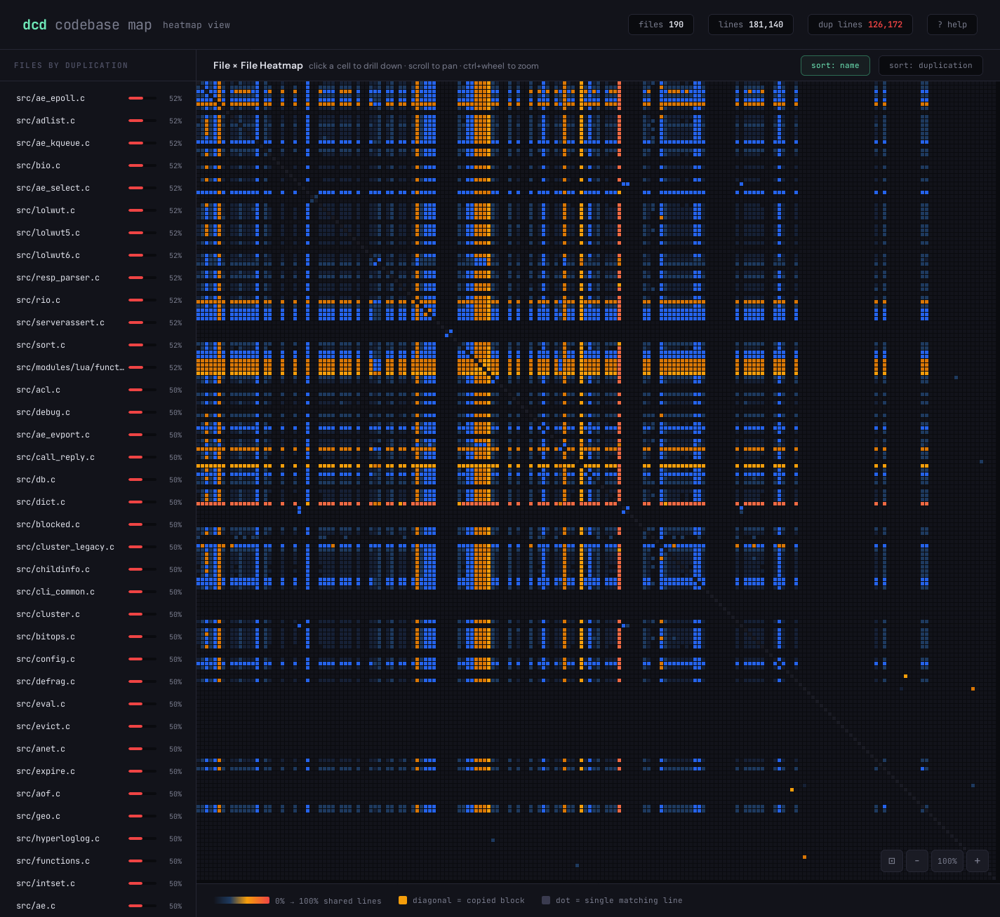
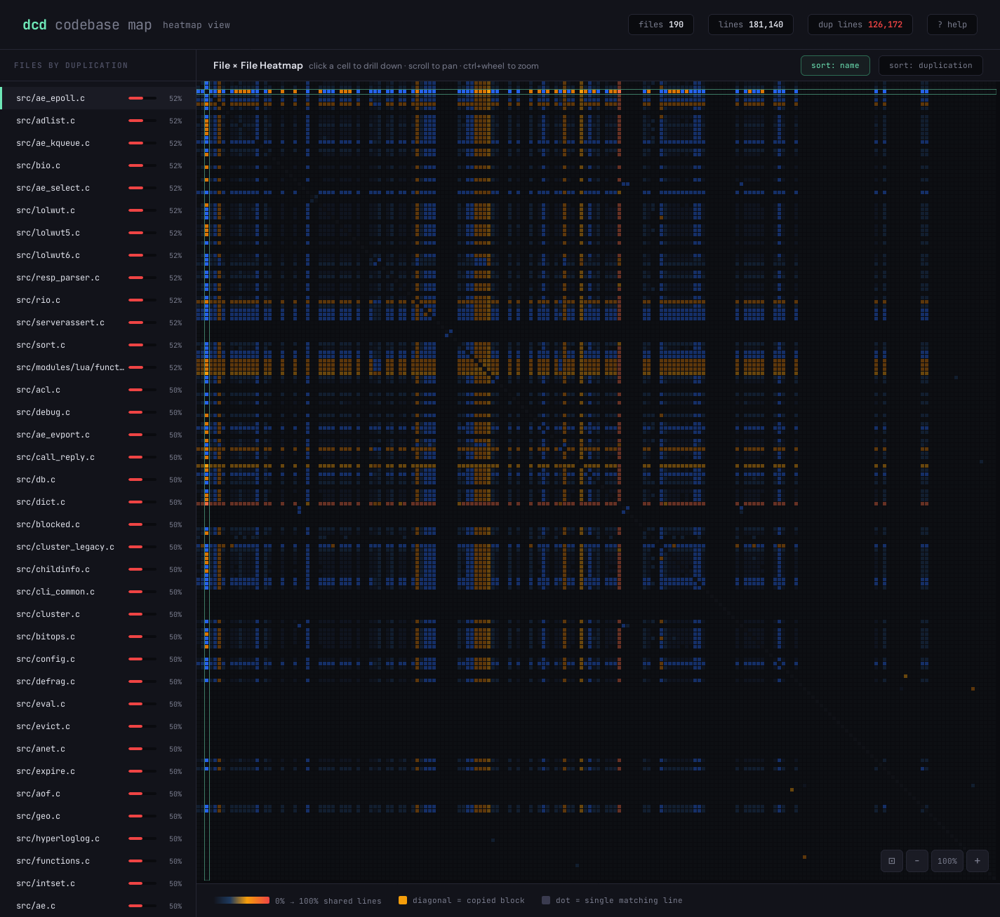
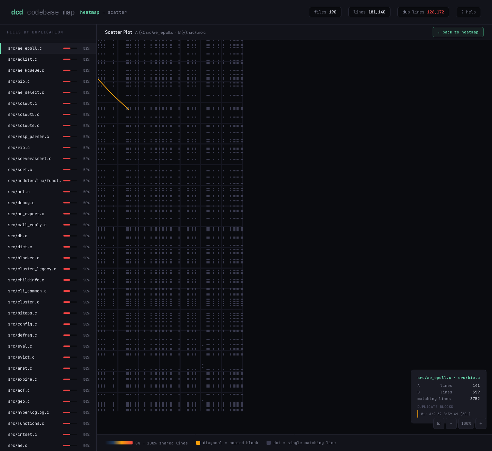

Duplicate Code Detector (dcd)
-----------------------------

A tool similar to [Simian](https://simian.quandarypeak.com/) designed to identify duplicate code within a project. It is, however, under a free software license.

[](https://goreportcard.com/report/github.com/boyter/dcd)
[](https://github.com/boyter/dcd/)

Licensed under [GNU Affero General Public License 3.0](https://www.gnu.org/licenses/agpl-3.0.html).

### Support

Using `dcd` commercially? If you want priority support for `dcd` you can purchase a years worth https://boyter.gumroad.com/l/wajuc which entitles you to priority direct email support from the developer.

### Install

#### Go Get

If you are comfortable using Go and have >= 1.19 installed:

```shell
go install github.com/boyter/dcd@latest
```

#### Manual

Binaries for GNU/Linux and macOS for both i386 and x86_64 and ARM64 machines are available from the [releases](https://github.com/boyter/dcd/releases) page.

### Pitch

Why use `dcd`?

- It's reasonably fast and works with large projects
- Works very well across multiple platforms without slowdown (GNU/Linux, macOS)
- Supports fuzzy matching to catch near-duplicate lines
- Supports gap tolerance to find duplicate blocks even when lines have been inserted, deleted, or modified
- Can compare a single file against the rest of a codebase
- Can generate PBM scatter plot visualizations of the comparison matrix between two files
- Supports ignoring marked blocks of code (e.g. generated code) via configurable markers

### Usage

Command line usage of `dcd` is designed to be as simple as possible.
Full details can be found in `dcd --help` or `dcd -h`. Note that the below reflects the state of master, not a release.

```
$ dcd -h
dcd
Version 1.1.0
Ben Boyter <ben@boyter.org>

Usage:
  dcd [flags]

Flags:
      --duplicates-both-ways         report duplicates from both file perspectives (default reports each pair once)
  -x, --exclude-pattern strings      file and directory locations matching case sensitive patterns will be ignored [comma separated list: e.g. vendor,_test.go]
      --file string                  compare a single file against the rest of the codebase
      --format string                output format: text (default), json, or html
  -f, --fuzz uint8                   fuzzy value where higher numbers allow increasingly fuzzy lines to match, values 0-255 where 0 indicates exact match
  -g, --gap-tolerance int            allow gaps of up to N lines when matching duplicate blocks (0 = no gaps allowed)
  -h, --help                         help for dcd
      --ignore-blocks-end string     marker string to stop ignoring lines (e.g. duplicate-enable)
      --ignore-blocks-start string   marker string to start ignoring lines (e.g. duplicate-disable)
      --max-hole-size int            allow up to N consecutive modified lines (holes) within a duplicate diagonal (0 = no holes allowed)
  -i, --include-ext strings          limit to file extensions [comma separated list: e.g. go,java,js]
  -m, --match-length int             min match length (default 6)
      --max-gap-bridges int          maximum number of gap bridges allowed per duplicate match (default 1)
      --max-read-size-bytes int      number of bytes to read into a file with the remaining content ignored (default 10000000)
      --min-line-length int          number of bytes per average line for file to be considered minified (default 255)
      --no-gitignore                 disables .gitignore file logic
      --no-ignore                    disables .ignore file logic
      --pbm-file-a string            first file to compare for PBM scatter plot output
      --pbm-file-b string            second file to compare for PBM scatter plot output
      --pbm-output string            output path for PBM scatter plot file
      --process-same-file            find duplicate blocks within the same file
  -v, --verbose                      verbose output
      --version                      version for dcd
```

#### Basic usage

Running `dcd` with no arguments scans the current directory for duplicate code blocks:

```
$ dcd
Found duplicate lines in processor/cocomo_test.go:
 lines 0-8 match 0-8 in processor/workers_tokei_test.go (length 8)
Found duplicate lines in processor/detector_test.go:
 lines 0-8 match 0-8 in processor/processor_test.go (length 8)
Found duplicate lines in processor/filereader.go:
 lines 0-7 match 0-7 in processor/workers.go (length 7)

Found 98634 duplicate lines in 140 files
```

You can also pass a directory path: `dcd /path/to/project`.

#### Fuzzy matching

By default, `dcd` requires exact line matches. The `--fuzz` (`-f`) flag enables fuzzy matching using [simhash](https://en.wikipedia.org/wiki/SimHash) distance, allowing lines that are similar but not identical to be treated as matches.

The value ranges from 0 to 255, where 0 means exact match and higher values allow increasingly fuzzy matches. Low values (1-3) catch minor differences like variable renames or whitespace changes. Higher values catch more significant changes but may produce false positives.

```
# Find near-duplicate code with slight differences
$ dcd -f 2

# More permissive fuzzy matching
$ dcd -f 5
```

#### Gap tolerance

The `--gap-tolerance` (`-g`) flag allows `dcd` to bridge over small gaps in otherwise matching blocks. This catches duplicate blocks where a few lines have been inserted, deleted, or modified in one copy.

When set to N, the algorithm searches up to N positions ahead in both source and target to find the next matching line, bridging over the gap. The `--match-length` requirement still applies to the number of actual matching lines, regardless of any gaps bridged.

```
# Allow gaps of up to 2 lines within duplicate blocks
$ dcd -g 2

# Allow larger gaps with multiple bridges
$ dcd -g 3 --max-gap-bridges 3
```

The `--max-gap-bridges` flag (default 1) controls how many gaps can be bridged within a single duplicate block. Increasing this allows noisier but more permissive matching.

#### Hole tolerance

The `--max-hole-size` flag allows `dcd` to skip over modified lines within a diagonal match — lines that stayed in the same position but were changed. This is directly inspired by the [Ducasse et al. paper](https://ieeexplore.ieee.org/document/792593), where holes in diagonal patterns represent in-place modifications.

```
# Allow up to 2 consecutive modified lines within a match
$ dcd --max-hole-size 2
```

Holes differ from gaps:
- **Holes** (`--max-hole-size`): lines modified in place — the diagonal continues straight but some cells don't match
- **Gaps** (`--gap-tolerance`): lines inserted or deleted — the diagonal shifts to a new position

All three mechanisms are orthogonal and compose together: `--fuzz` controls line-level similarity, `--max-hole-size` handles in-place modifications, and `--gap-tolerance` handles insertions/deletions.

```
# Maximum duplicate detection: fuzzy lines, holes, and gap bridging
$ dcd -f 2 --max-hole-size 2 -g 2
```

When holes or gaps are present, the output includes counts:

```
Found duplicate lines in fileA.go:
 lines 10-25 match 30-46 in fileB.go (matching lines 14, holes 2)
 lines 50-68 match 80-100 in fileB.go (matching lines 15, holes 1, gaps 3)
```

#### Single file comparison

The `--file` flag compares a single file against the rest of the codebase, useful for checking whether a specific file contains code duplicated elsewhere:

```
$ dcd --file src/utils.go
```

#### PBM scatter plot

The `--pbm-file-a`, `--pbm-file-b`, and `--pbm-output` flags generate a [PBM (Portable Bitmap)](https://en.wikipedia.org/wiki/Netpbm#PBM_example) scatter plot of the comparison matrix between two files. This is directly inspired by the scatter plot visualization described in the [Ducasse et al. paper](https://ieeexplore.ieee.org/document/792593) — diagonals represent copied code, holes represent in-place modifications, and broken diagonals represent insertions/deletions.

All three flags must be specified together. When set, normal duplicate scanning is skipped and only the PBM file is produced.

```
# Compare two files and generate a scatter plot
$ dcd --pbm-file-a src/utils.go --pbm-file-b src/helpers.go --pbm-output scatter.pbm

# Self-comparison shows the main diagonal plus any internal duplication
$ dcd --pbm-file-a processor.go --pbm-file-b processor.go --pbm-output self.pbm

# Combine with fuzzy matching for a denser visualization
$ dcd --pbm-file-a fileA.go --pbm-file-b fileB.go --pbm-output fuzzy.pbm -f 2
```

The output is a P1 ASCII PBM file where each pixel represents a line pair: black (1) means the lines match, white (0) means they don't. The image can be viewed with any image viewer that supports PBM (GIMP, feh, ImageMagick's `display`, etc.).

| Duplicate code (self-comparison) | Totally different files | Some duplicate/copied code |
|:---:|:---:|:---:|
|  |  |  |

#### Same-file duplicates

By default, `dcd` only compares different files. Use `--process-same-file` to also find duplicate blocks within the same file:

```
$ dcd --process-same-file
```

#### Ignoring blocks of code

The `--ignore-blocks-start` and `--ignore-blocks-end` flags let you mark regions of code that should be excluded from duplicate detection. This is similar to [Simian's](https://simian.quandarypeak.com/) ignore feature. Lines between (and including) the start and end markers are zeroed out so the duplicate detector skips them.

Both flags must be specified together. The markers are matched case-insensitively against the normalized (lowercased, whitespace-stripped) line content using substring matching.

```
# Ignore lines between "duplicate-disable" and "duplicate-enable" markers
$ dcd --ignore-blocks-start duplicate-disable --ignore-blocks-end duplicate-enable
```

In your source code, add comments containing the marker strings:

```go
func example() {
    normalCode() // this line is checked for duplicates

    // duplicate-disable
    generatedCode()  // these lines are ignored
    moreGenerated()  // by the duplicate detector
    // duplicate-enable

    moreNormalCode() // this line is checked again
}
```

Multiple ignore blocks in the same file are supported — each start marker begins a new ignored region, and the next end marker closes it.

#### JSON output

The `--format` flag controls the output format. By default, `dcd` produces human-readable text. Use `--format json` to get structured JSON output, useful for integration with other tools or CI pipelines:

```
$ dcd --format json .
```

The JSON output has this structure:

```json
{
  "files": [
    {
      "path": "foo.go",
      "totalLines": 67,
      "duplicateLines": 20,
      "duplicatePercent": 29.9,
      "matches": [
        {
          "sourceStartLine": 10,
          "sourceEndLine": 25,
          "targetFile": "bar.go",
          "targetStartLine": 40,
          "targetEndLine": 55,
          "length": 15,
          "gapCount": 0,
          "holeCount": 0
        }
      ]
    }
  ],
  "summary": {
    "totalDuplicateLines": 25,
    "totalFiles": 5
  }
}
```

You can pipe the output to `jq` for further processing:

```
# Get just the summary
$ dcd --format json . | jq '.summary'

# List files with more than 50% duplication
$ dcd --format json . | jq '.files[] | select(.duplicatePercent > 50) | .path'
```

#### HTML report

The `--format html` flag generates a self-contained interactive HTML report for visually exploring duplication across your codebase. This is mostly a vanity output — it looks great and is useful for presentations, code reviews, or just getting a feel for where duplication lives in a project.

```
$ dcd --format html --duplicate-threshold -1 . > report.html
```

The report includes:

- **File × File heatmap** — a matrix showing duplication intensity between every file pair. Click any cell to drill down.
- **Scatter plot** — a Ducasse-style dot matrix for a selected file pair. Diagonal runs indicate copied blocks; scattered dots are common boilerplate.
- **Sidebar** — files ranked by their highest duplication percentage against any other file.

| Heatmap | Heatmap with selection | Scatter plot |
|:---:|:---:|:---:|
|  |  |  |

### Ignore Files

`dcd` supports .ignore files inside directories that it scans. This is similar to how ripgrep, ag and tokei work.
.ignore files use the same syntax as .gitignore files, and `dcd` will ignore files and directories
listed in them. You can add .ignore files to ignore things like vendored dependencies checked into the repository.
The idea is allowing you to add a file or folder to git and have it ignored in the duplicate scan.

### Development

If you want to hack away feel free! PR's are generally accepted.

### Package

The below produces all the packages for binary releases.

```
GOOS=darwin GOARCH=amd64 go build -ldflags="-s -w" && zip -r9 dcd-1.0.0-x86_64-apple-darwin.zip dcd
GOOS=darwin GOARCH=arm64 go build -ldflags="-s -w" && zip -r9 dcd-1.0.0-arm64-apple-darwin.zip dcd
GOOS=windows GOARCH=amd64 go build -ldflags="-s -w" && zip -r9 dcd-1.0.0-x86_64-pc-windows.zip dcd
GOOS=windows GOARCH=386 go build -ldflags="-s -w" && zip -r9 dcd-1.0.0-i386-pc-windows.zip dcd
GOOS=linux GOARCH=amd64 go build -ldflags="-s -w" && zip -r9 dcd-1.0.0-x86_64-unknown-linux.zip dcd
GOOS=linux GOARCH=386 go build -ldflags="-s -w" && zip -r9 dcd-1.0.0-i386-unknown-linux.zip dcd
GOOS=linux GOARCH=arm64 go build -ldflags="-s -w" && zip -r9 dcd-1.0.0-arm64-unknown-linux.zip dcd
```

### How it works

`dcd` uses a [simhash](https://en.wikipedia.org/wiki/SimHash)-based approach inspired by [this paper](https://ieeexplore.ieee.org/document/792593):

1. Files are grouped by extension. Each line is normalized (lowercased, whitespace stripped) and hashed via simhash. Lines within `--ignore-blocks-start`/`--ignore-blocks-end` markers are zeroed out and excluded from indexing.
2. A global hash-to-filename index enables fast candidate filtering — only file pairs sharing enough matching line hashes are compared.
3. For each candidate pair, a 2D boolean matrix is built comparing all lines.
4. Diagonal runs in the matrix identify contiguous duplicate sequences.
5. With `--fuzz`, simhash distance is used instead of exact hash equality.
6. With `--max-hole-size`, modified lines (holes) within a diagonal are tolerated — the diagonal stays straight but skips non-matching cells.
7. With `--gap-tolerance`, the algorithm searches ahead to bridge over insertions/deletions that shift the diagonal.

### Comparison with Simian

`dcd` was built as a free, open-source alternative to [Simian](https://simian.quandarypeak.com/). Here's how they compare:

| Feature | dcd | Simian |
|---|---|---|
| License | AGPL-3.0 (free) | Commercial |
| Language | Go (single binary, no runtime) | Java or .NET (requires JVM/.NET runtime) |
| Language-aware parsing | ✅ via [scc](https://github.com/boyter/scc) — 250+ languages | ✅ ~15 hardcoded languages |
| Ignore comments | ✅ `--ignore-comments` | ✅ implicit (comments not counted) |
| Ignore string literals | ✅ `--ignore-strings` | ✅ `ignoreStrings` flag |
| Ignore marked blocks | ✅ `--ignore-blocks-start/end` | ✅ `ignoreBlocks` option |
| Fuzzy / near-duplicate matching | ✅ `--fuzz` (simhash distance) | ❌ exact token matching only |
| Gap tolerance (inserted/deleted lines) | ✅ `--gap-tolerance` | ❌ |
| Hole tolerance (in-place modifications) | ✅ `--max-hole-size` | ❌ |
| Structured output | ✅ JSON, interactive HTML report | ✅ XML, YAML, plain, emacs, vs |
| Per-file duplication percentage | ✅ | ❌ |
| CI exit code on duplication | ✅ `--duplicate-threshold` | ✅ `failOnDuplication` |
| `.gitignore` / `.ignore` support | ✅ | ❌ |
| Scatter plot visualization | ✅ PBM format | ❌ |
| Same-file duplicate detection | ✅ `--process-same-file` | ✅ |
| Single-file vs codebase comparison | ✅ `--file` | ❌ |

The main things Simian still has that `dcd` does not: support for comparing two separate codebases against each other, and a broader set of structured report formats for IDE and build tool integration (Emacs, Visual Studio, Checkstyle/Ant task).

### Reading

Some of the ideas for detection taken from this paper https://ieeexplore.ieee.org/document/792593
